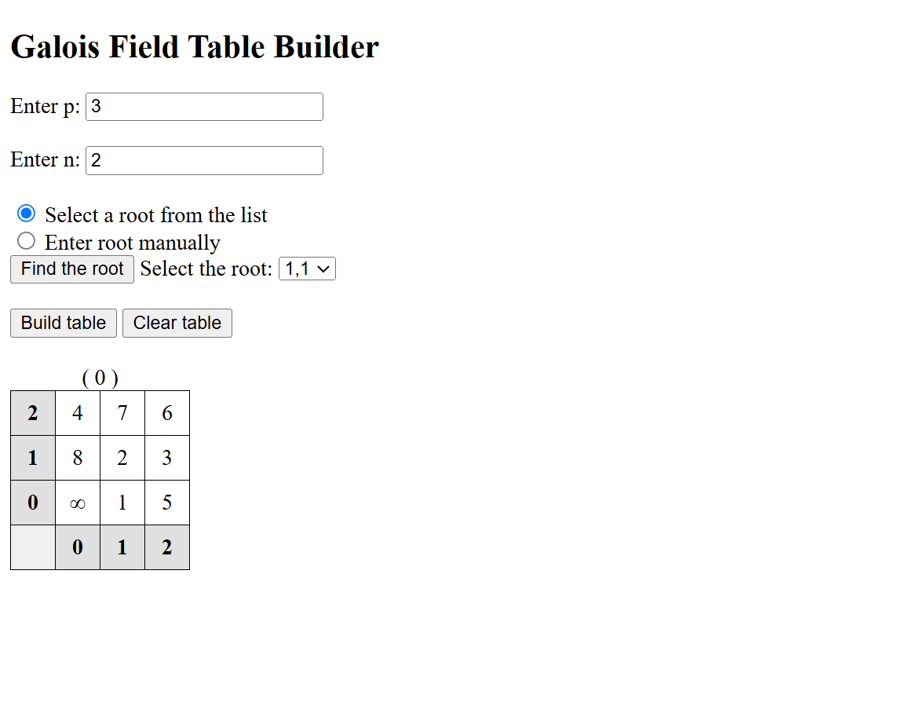
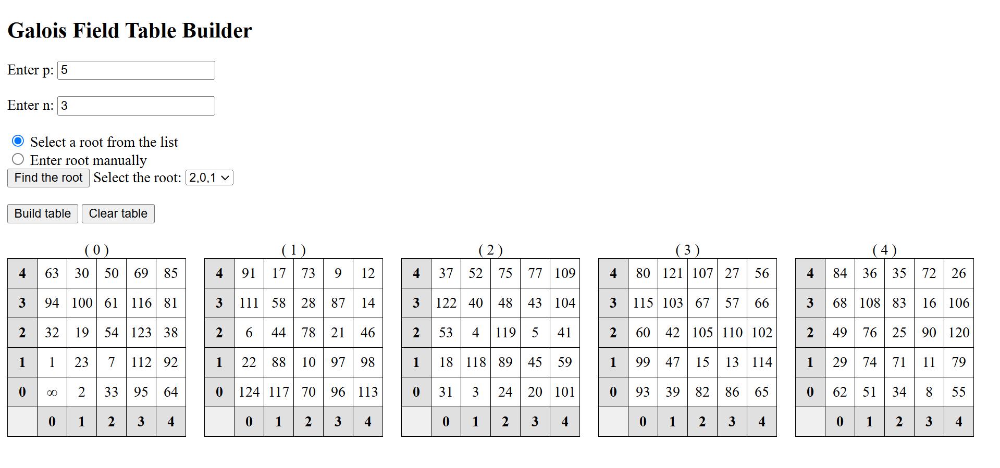
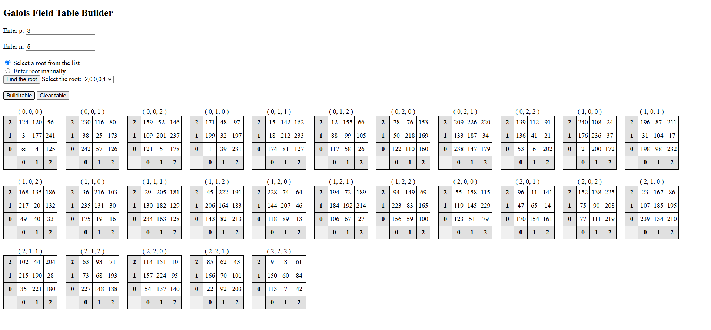

# Galois Field

This program is designed to study the Galois fields of various prime numbers and their powers. Read more about [Galois field (or Finite field)](https://en.wikipedia.org/wiki/Finite_field)

---
## Features

- **Builds a table of field numbers based on their coordinates**
- **Finds suitable roots for construction $p^n$**

---
## Screenshots

